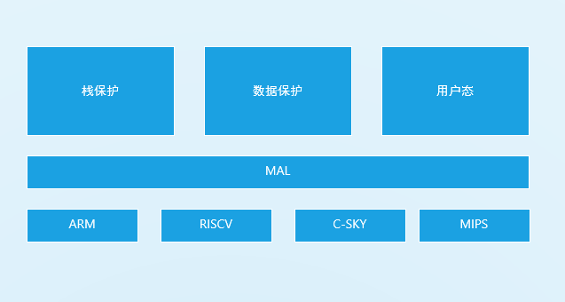

# MPU 抽象层

## 1、介绍

MAL （MPU Abstract Layer），即 mpu 抽象层。是 RT-Thread 自主研发的，支持安全的内存访问。

用户代码可以任意的访问非法的内存区域（其他任务的堆栈、野指针等），造成堆栈溢出、内存被修改、硬件错误等问题。所以需要由 MPU 来拘束任务、外设、内存的读写权限，提高系统的稳定性、安全性、成熟性、可靠性。MAL 组件就在这种需求下诞生了。

### 1.1 功能

- 线程堆栈保护，防止堆栈溢出
- 内存隔离，某一任务用到的内存区域不想被其他任务破坏
- MoM 支持为每个线程设定不同区域的内存访问权限，mpu 表快速切换 

### 1.2 内存权限

内存支持以下 6 种访问权限：

- no access
- privileged access only
- unprivileged access read-only
- full access
- privileged access read-only
- read-only access

### 1.3 框架图



### 1.4 数据流图


### 1.5 目录结构

MAL 组件目录结构如下所示：

```shell
MAL
├───docs 
│   └───figures                     // 文档使用图片
├───inc                             // 头文件目录
├───src                             // 源文件目录
├───port                            // 移植文件
│   LICENSE                         // 组件许可证
│   README.md                       // 软件包使用说明
│   Kconfig                         // 提供配置选项
└───SConscript                      // 工程构建脚本
```

## 2、MPU 抽象层宏定义

```c
#ifndef RT_MPU_ALIGN_SMALLEST_SIZE
#define RT_MPU_ALIGN_SMALLEST_SIZE     32                    /* mpu region smallest size */
#else
#if RT_MPU_ALIGN_SMALLEST_SIZE > 32
#define RT_MPU_ALIGN_SMALLEST_SIZE     32
#endif
#endif

#ifndef RT_MPU_THREAD_PROTECT_SIZE                        /* 线程堆栈溢出 */
#define RT_MPU_THREAD_PROTECT_SIZE     32
#endif

#define REGION_PERMISSION_Pos          0U                               /* Data access permissions, allows you to configure read/write access for User and Privileged mode */
#define REGION_PERMISSION_Msk          (0x7U << REGION_PERMISSION_Pos)

#define REGION_EXECUTE_Pos             4U                               /* Instruction access disable bit */
#define REGION_EXECUTE_Msk             (0x1U << REGION_EXECUTE_Pos)

#define REGION_TEX_Pos                 5U                               /* Type extension field */
#define REGION_TEX_Msk                 (0x1U << REGION_TEX_Pos)

#define REGION_SHAREABLE_Pos           6U                               /* Region is shareable between multiple bus masters */
#define REGION_SHAREABLE_Msk           (0x1U << REGION_SHAREABLE_Pos)

#define REGION_CACHEABLE_Pos           7U                               /* Region is cacheable */
#define REGION_CACHEABLE_Msk           (0x1U << REGION_CACHEABLE_Pos)

#define REGION_BUFFERABLE_Pos          8U                               /* Region is bufferable */
#define REGION_BUFFERABLE_Msk          (0x1U << REGION_BUFFERABLE_Pos)

#define REGION_SRD_Pos                 9U                               /* Sub-region disable field */
#define REGION_SRD_Msk                 (0xFFUL << REGION_SRD_Pos)

#define RT_MPU_REGION_NO_ACCESS                          0x0U
#define RT_MPU_REGION_PRIVILEGED_RW                      0x1U
#define RT_MPU_REGION_PRIVILEGED_RW_UNPRIV_RO            0x2U
#define RT_MPU_REGION_RW                                 0x3U
#define RT_MPU_REGION_PRIVILEGED_RO                      0x5U
#define RT_MPU_REGION_RO                                 0x6U

#define RT_MPU_REGION_EXECUTE_ENABLE                     0x0U
#define RT_MPU_REGION_EXECUTE_DISABLE                    0x1U

#define RT_MPU_REGION_TEX_ENABLE                         0x0U
#define RT_MPU_REGION_TEX_DISABLE                        0x1U

#define RT_MPU_REGION_SHAREABLE_ENABLE                   0x0U
#define RT_MPU_REGION_SHAREABLE_DISABLE                  0x1U

#define RT_MPU_REGION_CACHEABLE_ENABLE                   0x0U
#define RT_MPU_REGION_CACHEABLE_DISABLE                  0x1U

#define RT_MPU_REGION_BUFFERABLE_ENABLE                  0x0U
#define RT_MPU_REGION_BUFFERABLE_DISABLE                 0x1U

/**
* MPU Region Attribute
* \param access             Data access permissions, allows you to configure read/write access for User and Privileged mode.
* \param execute            Instruction access disable bit, 1= disable instruction fetches.
* \param shareable          Region is shareable between multiple bus masters.
* \param cacheable          Region is cacheable, i.e. its value may be kept in cache.
* \param bufferable         Region is bufferable, i.e. using write-back caching. Cacheable but non-bufferable regions use write-through policy.
* \param type_extern        Type extension field, allows you to configure memory access type, for example strongly ordered, peripheral.
* \param sub_region         Sub-region support.
*/ 
rt_inline rt_uint32_t rt_mpu_region_attribute(rt_uint32_t access,
                                              rt_uint32_t execute,
                                              rt_uint32_t shareable,
                                              rt_uint32_t cacheable,
                                              rt_uint32_t bufferable,
                                              rt_uint32_t type_extern,
                                              rt_uint32_t sub_region)
{
    rt_uint32_t attribute = 0;

    attribute = (((access     << REGION_PERMISSION_Pos)  & REGION_PERMISSION_Msk) | \
                ((execute     << REGION_EXECUTE_Pos)     & REGION_EXECUTE_Msk)    | \
                ((type_extern << REGION_TEX_Pos )        & REGION_TEX_Msk)        | \
                ((shareable   << REGION_SHAREABLE_Pos )  & REGION_SHAREABLE_Msk)  | \
                ((cacheable   << REGION_CACHEABLE_Pos )  & REGION_CACHEABLE_Msk)  | \
                ((bufferable  << REGION_BUFFERABLE_Pos ) & REGION_BUFFERABLE_Msk) | \
                ((sub_region  << REGION_SRD_Pos )        & REGION_SRD_Msk));

    return attribute;
};
```

## 3、MPU 抽象层结构体定义

```c
#ifndef __RT_DEF_H__
#define __RT_DEF_H__


#ifdef RT_USING_MAL

struct rt_mal_region
{
    rt_uint16_t region;
    rt_uint32_t addr;
    rt_uint32_t size;
    rt_uint32_t attribute;
};

struct rt_mal
{
    rt_uint16_t num;
#ifndef RT_MPU_REGION_NUMBERS              // MPU regions 数量，通过 Kconfig 配置
#define RT_MPU_REGION_NUMBERS   16
#endif
    struct rt_mal_region table[RT_MPU_REGION_NUMBERS];
};

#endif

/**
 * Thread structure
 */
struct rt_thread
{
    /* rt object */
    char        name[RT_NAME_MAX];                      /**< the name of thread */
    rt_uint8_t  type;                                   /**< type of object */
    rt_uint8_t  flags;                                  /**< thread's flags */

	...
	    /* memory protect unit if present */
#ifdef RT_USING_MAL
    struct rt_mal setting;                            /**< mpu tables setting */
    void (*mpu_hook)(void* addr, rt_uint32_t attribute);
#endif
}

#endif /* __RT_DEF_H__ */


#ifndef __MAL_H__
#define __MAL_H__

struct mpu_regions
{
    rt_uint32_t addr;
    rt_uint32_t size;
    rt_uint32_t attribute;
};

struct mpu_protect_regions      // 保护区域
{
    rt_thread_t thread;
    struct mpu_regions region;
};

struct rt_mpu_ops
{
   void (*switch_table) (rt_thread_t thread, rt_uint8_t mpu_protect_area_num, struct mpu_protect_regions* mpu_protect_areas); // 不同架构的 mpu 表切换接口
};
#endif /* __MAL_H__ */
```

## 4、MPU 抽象层函数

```c
rt_err_t rt_mpu_init(struct rt_mal_region *tables);
rt_err_t rt_mpu_attach(rt_thread_t thread, void* addr, size_t size, rt_uint32_t attribute);
rt_err_t rt_mpu_attach_table(rt_thread_t thread, struct mpu_regions *regions);
rt_err_t rt_mpu_delete(rt_thread_t thread, rt_uint8_t region);
rt_err_t rt_mpu_refresh(rt_thread_t thread, void *addr, size_t size, rt_uint32_t attribute, rt_uint8_t region);
rt_err_t rt_mpu_insert(rt_thread_t thread, void *addr, size_t size, rt_uint32_t attribute, rt_uint8_t region);
rt_err_t rt_mpu_get_info(rt_thread_t thread, rt_uint32_t type, void *arg);
rt_err_t rt_mpu_enable_protect_area(rt_thread_t thread, void *addr, size_t size, rt_uint32_t attribute);
rt_err_t rt_mpu_disable_protect_area(rt_thread_t thread, rt_uint8_t region);
void rt_mpu_table_switch(rt_thread_t thread);
rt_err_t rt_mpu_ops_register(struct rt_mpu_ops *ops);

void rt_mpu_exception_sethook(rt_thread_t thread, void (*hook)(void* addr, rt_uint32_t attribute));
void rt_mpu_exception_handler(rt_thread_t thread, void* addr, rt_uint32_t attribute);
```


