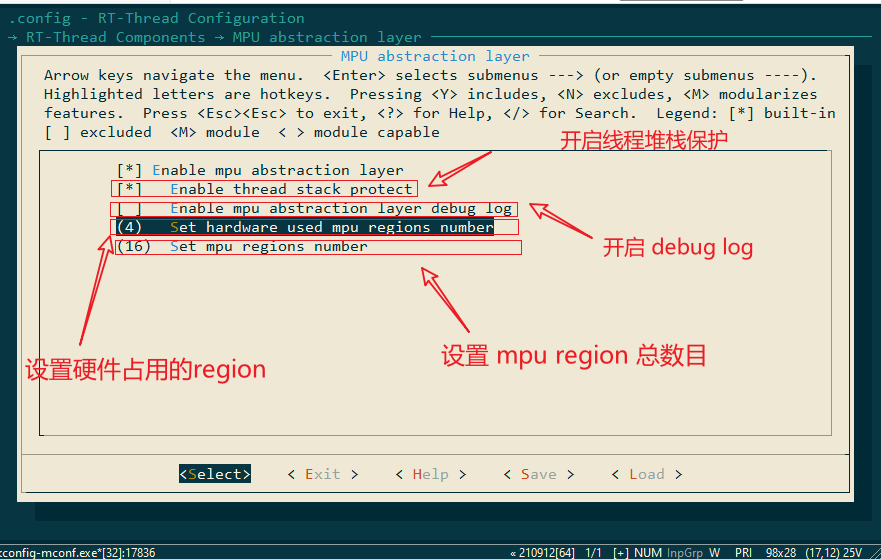

# MPU 抽象层

## 1.介绍

MAL （MPU Abstract Layer），即 mpu 抽象层。是 RT-Thread 自主研发的，支持安全的内存访问。

用户代码可以任意的访问非法的内存区域（其他任务的堆栈、野指针等），造成堆栈溢出、内存被修改、硬件错误等问题。所以需要由 MPU 来拘束任务、外设、内存的读写权限，提高系统的稳定性、安全性、成熟性、可靠性。MAL 组件就在这种需求下诞生了。

### 1.1 功能

- 线程堆栈保护，防止堆栈溢出
- 内存隔离，某一任务用到的内存区域不想被其他任务破坏
- MoM 支持为每个线程设定不同区域的内存访问权限，mpu 表快速切换 

### 1.2 内存权限

内存支持以下 6 种访问权限：

- no access：任何级别都没有读写权限
- privileged access only：只有特权级具有读写权限
- unprivileged access read-only：特权级有读写权限，非特权级只读
- full access：任何级别都具有读写权限
- privileged access read-only：特权级只读，非特权级没有读写权限
- read-only access：任何级别都只有读权限

### 1.3 工作原理

不同架构的芯片，MPU 可设置的 region 数目不同。

对于部分 cortex-m3 芯片，共有 8 个 region，系统配置占用 5 个，用户可配置区域为 1 个，保护区域 2 个：

| REGION | DESCRIPTION            |
| ------ | ---------------------- |
| 0      | FLASH                  |
| 1      | INTERNAL SRAM          |
| 2      | EXTERNAL SRAM          |
| 3      | PRIPHERALS             |
| 4      | THREAD STACK           |
| 5      | USER CONFIGURABLE AREA |
| 6      | PROTECT AREA0          |
| 7      | PROTECT AREA1          |

对于 cortex-m4/m7 芯片，共有 16个 region，系统配置占用 5 个，用户可配置区域为 8 个，保护区域 2 个：

| REGION | DESCRIPTION             |
| ------ | ----------------------- |
| 0      | FLASH                   |
| 1      | INTERNAL SRAM           |
| 2      | EXTERNAL SRAM           |
| 3      | PRIPHERALS              |
| 4      | THREAD STACK            |
| 5      | USER CONFIGURABLE AREA0 |
| ...    | USER CONFIGURABLE AREAx |
| 13     | USER CONFIGURABLE AREA8 |
| 14     | PROTECT AREA0           |
| 15     | PROTECT AREA1           |

**FLASH region、Internal SRAM、External SRAM、Pripherals**： 系统配置，BSP 制作者需要根据当前 BSP 配置进行初始化。

**Thread Stack region**：当线程第一次调度时，mal 组件层会设置线程堆栈底部（顶部） 32 个字节的访问权限（Read Only），当线程尝试修改自己堆栈的保护区域时，就会触发异常。

**PROTECT AREA region**：系统保护区域 region 配置。通过设置此 region，可以实现内存隔离，即某一任务用到的内存区域不会被其他任务破坏。

**USER CONFIGURABLE AREA region**：用户自定义 region 配置。设置当前线程的内存访问权限，该设置对其他线程无效。

### 1.4 框架图


### 1.5 数据流图


### 1.6 目录结构

MAL 组件目录结构如下所示：

```shell
MAL
├───docs 
│   └───figures                     // 文档使用图片
├───inc                             // 头文件目录
├───src                             // 源文件目录
├───port                            // 不同架构下的 MPU 对接 MAL 的移植文件
│   LICENSE                         // 组件许可证
│   README.md                       // 软件包使用说明
│   Kconfig                         // 提供配置选项
└───SConscript                      // 工程构建脚本
```

## 2.MAL API

MAL API 如下所示，[点击此处查看 API 参数详解](doc/mal_api.md)。

```c
/* 提供给应用层用户调用的 API */
rt_err_t rt_mpu_attach(rt_thread_t thread, void* addr, size_t size, rt_uint32_t attribute);
rt_err_t rt_mpu_attach_table(rt_thread_t thread, struct mpu_regions *regions);

rt_err_t rt_mpu_delete(rt_thread_t thread, rt_uint8_t region);
rt_err_t rt_mpu_refresh(rt_thread_t thread, void *addr, size_t size, rt_uint32_t attribute, rt_uint8_t region);

rt_err_t rt_mpu_enable_protect_area(rt_thread_t thread, void *addr, size_t size, rt_uint32_t attribute);
rt_err_t rt_mpu_disable_protect_area(rt_thread_t thread, rt_uint8_t region);

rt_err_t rt_mpu_insert(rt_thread_t thread, void *addr, size_t size, rt_uint32_t attribute, rt_uint8_t region);
rt_err_t rt_mpu_get_info(rt_thread_t thread, rt_uint32_t type, void *arg);

void rt_mpu_exception_sethook(rt_thread_t thread, rt_err_t (*hook)(void* addr, rt_uint32_t attribute));

void rt_mpu_table_switch(rt_thread_t thread);

/* 用于架构移植调用的 API */
rt_err_t rt_mpu_ops_register(struct rt_mpu_ops *ops);

/* 用于 BSP 移植调用的 API */
rt_err_t rt_mpu_init(struct rt_mal_region *tables);
rt_err_t rt_mpu_exception_handler(rt_thread_t thread, void* addr, rt_uint32_t attribute);
```

## 3.移植 MAL

MAL 移植分为两个层面的移植：架构层移植，和 BSP 层移植。

架构层移植：架构移植文件位于 MAL 组件的 port 文件夹下，以 xxx_mal.c 命名，如 arm 架构移植文件命名为 arm_mal.c，适用于所有 arm 架构。

- [不同 架构 移植 MAL 组件教程](doc/mal_arch.md) 

BSP 层移植：BSP 移植文件位于具体的 bsp 中，主要工作是初始化 MPU，完成 MPU 异常处理。

- [不同 BSP 移植 MAL 组件教程](doc/mal_bsp.md) 

## 4.使用 MAL

### 4.1 开启 MAL 组件

在工程目录下，打开 `env` 工具，使能 MPU 抽象层：



- Enable mpu abstraction layer：开启 mal 组件
- Enable thread stack protect：开启线程堆栈保护，默认开启
- Enable mpu abstraction layer debug log：开启 mal 组件 debug 日志
- Set hardware used mpu regions number：设置硬件占用的 region 数目
- Set mpu regions number：设置 mpu 总的 region 数目

### 4.2 示例：设置线程保护区域

设置一块内存区域，只有当前线程具有访问权限，其他线程禁止访问。

```c
#include <rtthread.h>
#include <rtdevice.h>
#include <board.h>

#ifdef RT_USING_MAL
#include <mal.h>
#endif

#define THREAD_PRIORITY    25
#define THREAD_MEMORY_SIZE 1024
uint8_t thread_stack[THREAD_MEMORY_SIZE] __attribute__((aligned(THREAD_MEMORY_SIZE)));
uint8_t thread1_stack[THREAD_MEMORY_SIZE] __attribute__((aligned(THREAD_MEMORY_SIZE)));
uint8_t protect_memory[THREAD_MEMORY_SIZE] __attribute__((aligned(THREAD_MEMORY_SIZE)));
struct rt_thread tid = {0};
struct rt_thread tid1 = {0};

static void thread1_entry(void *param)
{
    while (1)
    {
        protect_memory[0] = 1;
        rt_thread_mdelay(1000);
    }
}

static rt_err_t mpu1_thread_handle(void *addr, rt_uint32_t attribute)
{
    rt_kprintf("error memory addr: %p\n", addr);

    rt_thread_detach(rt_thread_self());
    rt_schedule();

    return RT_EOK;
}

int main(void)
{
    rt_thread_init(&tid, "mpu", thread1_entry, RT_NULL, thread_stack, THREAD_MEMORY_SIZE, THREAD_PRIORITY, 20);
    {
        rt_mpu_enable_protect_area(&tid, protect_memory, THREAD_MEMORY_SIZE, RT_MPU_REGION_PRIVILEGED_RW); /* 设置保护区域 */
        rt_thread_startup(&tid);
    }

    rt_thread_init(&tid1, "mpu1", thread1_entry, RT_NULL, thread1_stack, THREAD_MEMORY_SIZE, THREAD_PRIORITY, 20);
    {
        rt_mpu_exception_sethook(&tid1, mpu1_thread_handle);
        rt_thread_startup(&tid1);
    }

    while (1)
    {
        rt_thread_mdelay(500);
    }
}
```

当线程 `mpu1` 访问内存区域 `protect_memory` 时，就会触发内存异常中断服务。如果该线程注册了 mpu 异常回调函数，mal 组件层就会调用该函数，在线程 mpu 异常钩子函数中，杀掉 mpu1 线程，使系统能够继续正常运行。


### 4.3 示例：设置线程受限区域

只针对当前线程，禁止对某块区域进行读写操作：

```c
#include <rtthread.h>
#include <rtdevice.h>
#include <board.h>

#ifdef RT_USING_MAL
#include <mal.h>
#endif

#define THREAD_PRIORITY         25
#define THREAD_MEMORY_SIZE      1024
uint8_t thread_stack[THREAD_MEMORY_SIZE] __attribute__((aligned(THREAD_MEMORY_SIZE)));
uint8_t protect_memory[THREAD_MEMORY_SIZE] __attribute__((aligned(THREAD_MEMORY_SIZE)));
struct rt_thread tid = {0};

static void thread1_entry(void *param)
{
   while (1)
   {
        protect_memory[0] = 1;
        rt_thread_mdelay(1000);
   }
}

static rt_err_t mpu_thread_handle(void *addr, rt_uint32_t attribute)
{
    rt_kprintf("error memory addr: %p\n", addr);

    rt_thread_detach(rt_thread_self());
    rt_schedule();

    return RT_EOK;
}

int main(void)
{
    rt_thread_init(&tid, "mpu", thread1_entry, RT_NULL, thread_stack, THREAD_MEMORY_SIZE, THREAD_PRIORITY, 20);
    {
        rt_mpu_attach(&tid, protect_memory, THREAD_MEMORY_SIZE, RT_MPU_REGION_NO_ACCESS);
        rt_mpu_exception_sethook(&tid, mpu_thread_handle);
        rt_thread_startup(&tid);
    }

    while (1)
    {
        rt_thread_mdelay(500);
    }
}
```

当线程 `mpu` 访问内存区域 `protect_memory` 时，就会触发 mpu 异常。在线程 mpu 异常钩子函数中，杀掉 mpu 线程，使系统能够继续正常运行：


